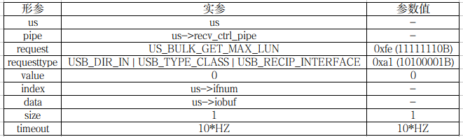

# USB Storage代码流程分析

[TOC]

---

## 0. 前言
&ensp;&ensp;&ensp;&ensp;当前已从linux kernel剥离出USB storage驱动代码，并做成源码树形式，可通过ctags或source insight等工具进行解读，路径在git-usb目录下，其中代码已添加必要注释，以下会按照函数流程做主要代码的解读。

## 1. 函数入口
### 1.1 注册函数分析
&ensp;&ensp;&ensp;&ensp;函数入口在文件drivers/usb/storage/usb.c中，为最后一行代码：

```C
/* USB storage入口函数 */
module_usb_stor_driver(usb_storage_driver, usb_stor_host_template, DRV_NAME);
```

&ensp;&ensp;&ensp;&ensp;这是一个usb storage封装注册函数，其中参数**usb_storage_driver**即usb storage接口驱动struct usb_driver结构体实例，用于在usb核心层识别usb接口驱动，**usb_stor_host_template**为scsi_host_template结构体实例，为一个本地变量，用于与scsi层通信，定义如下：
```C
/* struct scsi_host_template结构体实例usb_stor_host_template */
static struct scsi_host_template usb_stor_host_template;
```

宏定义**DRV_NAME**如下：

```C
/* 驱动名，后续很多地方用到 */
#define DRV_NAME "usb-storage"
```

解析该封装函数如下：

```C
#define module_usb_stor_driver(__driver, __sht, __name) \
static int __init __driver##_init(void) \
{ \ 
    usb_stor_host_template_init(&(__sht), __name, THIS_MODULE); \
    return usb_register(&(__driver)); \
} \ 
module_init(__driver##_init); \
static void __exit __driver##_exit(void) \
{ \ 
    usb_deregister(&(__driver)); \
} \
module_exit(__driver##_exit)
```

&ensp;&ensp;&ensp;&ensp;这其中介绍一下usb_stor_host_template_init()函数，其是初始化usb.c中定义的struct scsi_host_template实例，代码实现在drivers/usb/storage/scsiglue.c中：

```C
/* 初始化struct scsi_host_template结构体实例 */
void usb_stor_host_template_init(struct scsi_host_template *sht,
                 const char *name, struct module *owner)
{
    *sht = usb_stor_host_template;
    sht->name = name;
    sht->proc_name = name;
    sht->module = owner;
}
EXPORT_SYMBOL_GPL(usb_stor_host_template_init);
```
&ensp;&ensp;&ensp;&ensp;即将传入的参数sht与具体的实现usb_stor_host_template结构体联结，结构体usb_stor_host_template在该段代码实现之上定义：

```C
/*
 * this defines our host template, with which we'll allocate hosts
 */
static const struct scsi_host_template usb_stor_host_template = {
    /* basic userland interface stuff */
    .name =             "usb-storage",
    .proc_name =            "usb-storage",
    .show_info =            show_info,
    .write_info =           write_info,
    .info =             host_info,

    /* command interface -- queued only */
    .queuecommand =         queuecommand,

    /* error and abort handlers */
    .eh_abort_handler =     command_abort,
    .eh_device_reset_handler =  device_reset,
    .eh_bus_reset_handler =     bus_reset,

    /* queue commands only, only one command per LUN */
    .can_queue =            1,

    /* unknown initiator id */
    .this_id =          -1,

    .slave_alloc =          slave_alloc,
    .slave_configure =      slave_configure,
    .target_alloc =         target_alloc,

    /* lots of sg segments can be handled */
    .sg_tablesize =         SG_MAX_SEGMENTS,

    /*
     * Limit the total size of a transfer to 120 KB.
     *
     * Some devices are known to choke with anything larger. It seems like
     * the problem stems from the fact that original IDE controllers had
     * only an 8-bit register to hold the number of sectors in one transfer
     * and even those couldn't handle a full 256 sectors.
     *
     * Because we want to make sure we interoperate with as many devices as
     * possible, we will maintain a 240 sector transfer size limit for USB
     * Mass Storage devices.
     *
     * Tests show that other operating have similar limits with Microsoft
     * Windows 7 limiting transfers to 128 sectors for both USB2 and USB3
     * and Apple Mac OS X 10.11 limiting transfers to 256 sectors for USB2
     * and 2048 for USB3 devices.
     */
    .max_sectors =                  240,

    /*
     * merge commands... this seems to help performance, but
     * periodically someone should test to see which setting is more
     * optimal.
     */
    .use_clustering =       1,

    /* emulated HBA */
    .emulated =         1,

    /* we do our own delay after a device or bus reset */
    .skip_settle_delay =        1,

    /* sysfs device attributes */
    .sdev_attrs =           sysfs_device_attr_list,

    /* module management */
    .module =           THIS_MODULE
};
```
&ensp;&ensp;&ensp;&ensp;这个结构体是usb storage与scsi核心层最最关键的接口，结构体内实现了很多函数，scsi核心层会通过这些函数下发数据（queuecommand()函数），报异常（command_abort()函数），设备重置（device_reset()处理句柄），总线重置（bus_reset()处理句柄）等，还有scsi控制器信息显示相关函数show_info()，write_info()，host_info()等。此处只关注queuecommand()和command_abort()函数，且待后续用到才一一介绍。

### 1.2 驱动结构体分析
&ensp;&ensp;&ensp;&ensp;现继续跟踪1.1节介绍过的usb_storage_driver结构体实现。
```C
static struct usb_driver usb_storage_driver = {
    .name =     DRV_NAME,
    .probe =    storage_probe,
    .disconnect =   usb_stor_disconnect,
    .suspend =  usb_stor_suspend,
    .resume =   usb_stor_resume,
    .reset_resume = usb_stor_reset_resume,
    .pre_reset =    usb_stor_pre_reset,
    .post_reset =   usb_stor_post_reset,
    .id_table = usb_storage_usb_ids,
    .supports_autosuspend = 1,
    .soft_unbind =  1,
};
```
&ensp;&ensp;&ensp;&ensp;这其中主要看三个元素实现：.probe()、.disconnect()、.id_table，其它部分暂时没能力和精力分析清楚。先看id_table对应的实现：usb_storage_usb_ids，代码实现如下：

```C
struct usb_device_id usb_storage_usb_ids[] = {
#   include "unusual_devs.h"
    { }     /* Terminating entry */
}; 
MODULE_DEVICE_TABLE(usb, usb_storage_usb_ids);
```
&ensp;&ensp;&ensp;&ensp;unusual_devs，顾名思义，不是通用设备，这个文件不简单，是所有不常用的USB存储设备及常用的USB存储设备的集合，稍后会继续介绍。此处即是对新匹配的设备进行设备，若在设备列表内，则执行probe()匹配函数。进unusual_devs.h文件查看一下，此处该文件在两处使用了。此处作为usb_storage_usb_ids[]结构体内元素第一次使用，另一处在probe()函数中使用：

```C
/* patch submitted by Vivian Bregier <Vivian.Bregier@imag.fr> */
UNUSUAL_DEV(  0x03eb, 0x2002, 0x0100, 0x0100,     /* 不常用设备 */
        "ATMEL",
        "SND1 Storage",
        USB_SC_DEVICE, USB_PR_DEVICE, NULL,
        US_FL_IGNORE_RESIDUE),
        
...
/* 通用设备 */
/* Control/Bulk transport for all SubClass values */
USUAL_DEV(USB_SC_RBC, USB_PR_CB),
USUAL_DEV(USB_SC_8020, USB_PR_CB),
USUAL_DEV(USB_SC_QIC, USB_PR_CB),
USUAL_DEV(USB_SC_UFI, USB_PR_CB),
USUAL_DEV(USB_SC_8070, USB_PR_CB),
USUAL_DEV(USB_SC_SCSI, USB_PR_CB),

/* Control/Bulk/Interrupt transport for all SubClass values */
USUAL_DEV(USB_SC_RBC, USB_PR_CBI),
USUAL_DEV(USB_SC_8020, USB_PR_CBI),
USUAL_DEV(USB_SC_QIC, USB_PR_CBI),
USUAL_DEV(USB_SC_UFI, USB_PR_CBI),
USUAL_DEV(USB_SC_8070, USB_PR_CBI),
USUAL_DEV(USB_SC_SCSI, USB_PR_CBI),

/* Bulk-only transport for all SubClass values */
USUAL_DEV(USB_SC_RBC, USB_PR_BULK),
USUAL_DEV(USB_SC_8020, USB_PR_BULK),
USUAL_DEV(USB_SC_QIC, USB_PR_BULK),
USUAL_DEV(USB_SC_UFI, USB_PR_BULK),
USUAL_DEV(USB_SC_8070, USB_PR_BULK),
USUAL_DEV(USB_SC_SCSI, USB_PR_BULK),  /* U盘使用此宏定义 */
```
&ensp;&ensp;&ensp;&ensp;其中此处的UNUSUAL_DEV()和USUAL_DEV()宏定义在drivers/usb/storage/usual-tables.c中定义，仅用于驱动匹配设备时之用：

```C
/* 
 * The table of devices
 */ 
#define UNUSUAL_DEV(id_vendor, id_product, bcdDeviceMin, bcdDeviceMax, \
            vendorName, productName, useProtocol, useTransport, \
            initFunction, flags) \
{ USB_DEVICE_VER(id_vendor, id_product, bcdDeviceMin, bcdDeviceMax), \
  .driver_info = (flags) }
            
#define COMPLIANT_DEV   UNUSUAL_DEV

#define USUAL_DEV(useProto, useTrans) \ 
{ USB_INTERFACE_INFO(USB_CLASS_MASS_STORAGE, useProto, useTrans) }
...
#undef UNUSUAL_DEV  /* 注销宏定义*/
#undef COMPLIANT_DEV
#undef USUAL_DEV
```

## 2. probe()函数
&ensp;&ensp;&ensp;&ensp;现在开始主要介绍probe()函数，先看函数：

```C
/* The main probe routine for standard devices */
static int storage_probe(struct usb_interface *intf,
             const struct usb_device_id *id)
{
    struct us_unusual_dev *unusual_dev;
    struct us_data *us;
    int result;
    int size;

    /* If uas is enabled and this device can do uas then ignore it. */
#if IS_ENABLED(CONFIG_USB_UAS) /* uas: usb attached scsi protocol */
    if (uas_use_uas_driver(intf, id, NULL))
        return -ENXIO;
#endif

    /*
     * If the device isn't standard (is handled by a subdriver
     * module) then don't accept it.
     */
    if (usb_usual_ignore_device(intf))
        return -ENXIO;

    /*
     * Call the general probe procedures.
     *
     * The unusual_dev_list array is parallel to the usb_storage_usb_ids
     * table, so we use the index of the id entry to find the
     * corresponding unusual_devs entry.
     */

    size = ARRAY_SIZE(us_unusual_dev_list);
    if (id >= usb_storage_usb_ids && id < usb_storage_usb_ids + size) {
        unusual_dev = (id - usb_storage_usb_ids) + us_unusual_dev_list;
    } else {
        unusual_dev = &for_dynamic_ids;
    
        dev_dbg(&intf->dev, "Use Bulk-Only transport with the Transparent SCSI protocol for dynamic id: 0x%04x 0x%04x\n",
            id->idVendor, id->idProduct);
    }
    
    result = usb_stor_probe1(&us, intf, id, unusual_dev,
                 &usb_stor_host_template);
    if (result)
        return result;
    
    /* No special transport or protocol settings in the main module */

    result = usb_stor_probe2(us);
    return result;
}
```

现在开始从上往下分析：
### 2.1 函数变量分析
&ensp;&ensp;&ensp;&ensp;storage_probe()函数声明了四个函数变量，代码如下：
```C
    struct us_unusual_dev *unusual_dev;
    struct us_data *us;
    int result;
    int size;
```
&ensp;&ensp;&ensp;&ensp;其中变量unusual_dev不常用device列表结构体的实例，struct us_unusual_dev结构体定义如下，在probe函数中用于排查不常用device之用：

```C
/*
 * Unusual device list definitions 
 */
struct us_unusual_dev {
    const char* vendorName;
    const char* productName;
    __u8  useProtocol;
    __u8  useTransport;
    int (*initFunction)(struct us_data *);
};
```
&ensp;&ensp;&ensp;&ensp;struct us_data结构体是USB storage驱动中自定义的贯穿始终的一个非常重要的结构体，相当于一个全局变量了。变量名**us**即usb storage。
&ensp;&ensp;&ensp;&ensp;result变量为函数结果收集，size变量作为不常用device集合的个数变量在用。

### 2.2 uas_use_uas_driver()函数解析
&ensp;&ensp;&ensp;&ensp;uas_use_uas_driver()函数，暂时不进行解读，但是UAS/UASP可以简单介绍以下：

- Bulk Only Transport（以下简称[**BOT**]）被用于[**USB2**]海量存储类设备，在微控制器中实现是简单而廉价的，因此适合于价格低廉的基于闪存的存储产品；
- [**BOT**]是单线程事务处理，每个由host初始化好的事务，只有在被device处理完成且处理完成状态传回给初始化线程之后才能开始下一个事务处理。这将在整个数据传输中产生显著的开销（约20%）。[**USB3**]将数据传输带宽从480Mb/s增加到5Gb/s，但如果[**BOT**]协议仍然存在，则分析表明，2.4GHz核心Duo<sup>TM</sup>上的实际传输速率将约为250Mb/s，以及12%的CPU使用率；
- **UASP**(USB Attached SCSI Protocol)将提高[**USB2**]的效率，并利用[**USB3**]全双工功能允许超过400Mb/s的数据传输。新协议将需要新的host软件和device固件，通过支持[**BOT**]和[**UAS**]的设备来实现向后兼容。

### 2.3 usb_usual_ignore_device()函数解析
&ensp;&ensp;&ensp;&ensp;函数实现在drivers/usb/storage/usual-tables.c中：
```C
#define UNUSUAL_DEV(id_vendor, id_product, bcdDeviceMin, bcdDeviceMax, \
            vendorName, productName, useProtocol, useTransport, \
            initFunction, flags) \
{                   \
    .vid    = id_vendor,        \
    .pid    = id_product,       \
    .bcdmin = bcdDeviceMin,     \
    .bcdmax = bcdDeviceMax,     \
}
    
static struct ignore_entry ignore_ids[] = {
#   include "unusual_alauda.h"
#   include "unusual_cypress.h"
#   include "unusual_datafab.h"
#   include "unusual_ene_ub6250.h"
#   include "unusual_freecom.h"
#   include "unusual_isd200.h"
#   include "unusual_jumpshot.h"
#   include "unusual_karma.h"
#   include "unusual_onetouch.h"
#   include "unusual_realtek.h"
#   include "unusual_sddr09.h"
#   include "unusual_sddr55.h"
#   include "unusual_usbat.h"
    { }     /* Terminating entry */
};

#undef UNUSUAL_DEV

/* Return an error if a device is in the ignore_ids list */
int usb_usual_ignore_device(struct usb_interface *intf)
{
    struct usb_device *udev;
    unsigned vid, pid, bcd;
    struct ignore_entry *p;

    udev = interface_to_usbdev(intf);
    vid = le16_to_cpu(udev->descriptor.idVendor);
    pid = le16_to_cpu(udev->descriptor.idProduct);
    bcd = le16_to_cpu(udev->descriptor.bcdDevice);

    for (p = ignore_ids; p->vid; ++p) {
        if (p->vid == vid && p->pid == pid && 
                p->bcdmin <= bcd && p->bcdmax >= bcd)
            return -ENXIO;
    }
    return 0;
} 
```
&ensp;&ensp;&ensp;&ensp;此处又重新定义了一遍**UNUSUAL_DEV**宏定义，usb_usual_ignore_device()函数的功能即是排查匹配上的设备，如果不是标准device，则退出此通用USB storage驱动，而去匹配对应的子模块驱动。此处也不做深究。

### 2.4 unusual_dev变量赋值
&ensp;&ensp;&ensp;&ensp;接下来是对变量unusual_dev的赋值，代码如下：
```C
    /*
     * Call the general probe procedures.
     *
     * The unusual_dev_list array is parallel to the usb_storage_usb_ids
     * table, so we use the index of the id entry to find the
     * corresponding unusual_devs entry.
     */

    size = ARRAY_SIZE(us_unusual_dev_list);
    if (id >= usb_storage_usb_ids && id < usb_storage_usb_ids + size) {
        unusual_dev = (id - usb_storage_usb_ids) + us_unusual_dev_list;
    } else {
        unusual_dev = &for_dynamic_ids;

        dev_dbg(&intf->dev, "Use Bulk-Only transport with the Transparent SCSI protocol for dynamic id: 0x%04x 0x%04x\n",
            id->idVendor, id->idProduct);
    }
```
&ensp;&ensp;&ensp;&ensp;其中us_unusual_dev_list为usb.c中定义的静态变量，代码如下：
```C
/*
 * The entries in this table correspond, line for line,
 * with the entries in usb_storage_usb_ids[], defined in usual-tables.c.
 */

/*
 *The vendor name should be kept at eight characters or less, and
 * the product name should be kept at 16 characters or less. If a device
 * has the US_FL_FIX_INQUIRY flag, then the vendor and product names
 * normally generated by a device through the INQUIRY response will be
 * taken from this list, and this is the reason for the above size
 * restriction. However, if the flag is not present, then you
 * are free to use as many characters as you like.
 */

#define UNUSUAL_DEV(idVendor, idProduct, bcdDeviceMin, bcdDeviceMax, \
            vendor_name, product_name, use_protocol, use_transport, \
            init_function, Flags) \
{ \
    .vendorName = vendor_name,  \
    .productName = product_name,    \
    .useProtocol = use_protocol,    \
    .useTransport = use_transport,  \
    .initFunction = init_function,  \
}

#define COMPLIANT_DEV   UNUSUAL_DEV

#define USUAL_DEV(use_protocol, use_transport) \
{ \
    .useProtocol = use_protocol,    \
    .useTransport = use_transport,  \
}

#define UNUSUAL_VENDOR_INTF(idVendor, cl, sc, pr, \
        vendor_name, product_name, use_protocol, use_transport, \
        init_function, Flags) \
{ \
    .vendorName = vendor_name,  \
    .productName = product_name,    \
    .useProtocol = use_protocol,    \
    .useTransport = use_transport,  \
    .initFunction = init_function,  \
}

static struct us_unusual_dev us_unusual_dev_list[] = {
#   include "unusual_devs.h"
    { }     /* Terminating entry */
};

static struct us_unusual_dev for_dynamic_ids =
        USUAL_DEV(USB_SC_SCSI, USB_PR_BULK);

#undef UNUSUAL_DEV
#undef COMPLIANT_DEV
#undef USUAL_DEV
#undef UNUSUAL_VENDOR_INTF
```
&ensp;&ensp;&ensp;&ensp;此处做了以下几件事：

- 将unusual_devs.h文件引入作为结构体元素，在1.2节中介绍过这个.h文件，其中包含了不常用USB存储device和标准USB存储device，此处只是将**UNUSUAL_DEV**和**USUAL_DEV**宏定义重定义了一下；并引入**UNUSUAL_VENDOR_INTF**宏定义，请记住此处的init_function，后续还会用此函数实现来完成某些device特定的软硬件件操作。
- 通过usb_storage_usb_ids变量来定位匹配上的device在unusual_devs.h中的位置，再来找到在us_unusual_dev_list中的位置；
- 定义了静态变量for_dynamic_ids，其也是struct us_unusual_dev结构体实例，即：
   - 将.useProtocol赋值为USB_SC_SCSI；
   - 将.useTransport赋值为USB_PR_BULK。

### 2.5 usb_stor_probe1()函数解析
&ensp;&ensp;&ensp;&ensp;函数实现如下，稍后各小节再逐条进行分析：
```C
/* First part of general USB mass-storage probing */
int usb_stor_probe1(struct us_data **pus,
        struct usb_interface *intf,
        const struct usb_device_id *id,
        struct us_unusual_dev *unusual_dev,
        struct scsi_host_template *sht)
{
    struct Scsi_Host *host;
    struct us_data *us;
    int result;

    dev_info(&intf->dev, "USB Mass Storage device detected\n");

    /*
     * Ask the SCSI layer to allocate a host structure, with extra
     * space at the end for our private us_data structure.
     */
    host = scsi_host_alloc(sht, sizeof(*us));
    if (!host) {
        dev_warn(&intf->dev, "Unable to allocate the scsi host\n");
        return -ENOMEM;
    }
    
    /*
     * Allow 16-byte CDBs and thus > 2TB
     */
    host->max_cmd_len = 16;
    host->sg_tablesize = usb_stor_sg_tablesize(intf);
    *pus = us = host_to_us(host);
    mutex_init(&(us->dev_mutex));
    us_set_lock_class(&us->dev_mutex, intf);
    init_completion(&us->cmnd_ready);
    init_completion(&(us->notify));
    init_waitqueue_head(&us->delay_wait);
    INIT_DELAYED_WORK(&us->scan_dwork, usb_stor_scan_dwork);

    /* Associate the us_data structure with the USB device */
    result = associate_dev(us, intf);
    if (result)
        goto BadDevice;

    /* Get the unusual_devs entries and the descriptors */
    result = get_device_info(us, id, unusual_dev);
    if (result)
        goto BadDevice;

    /* Get standard transport and protocol settings */
    get_transport(us);
    get_protocol(us);

    /*
     * Give the caller a chance to fill in specialized transport
     * or protocol settings.
     */
    return 0;

BadDevice:
    usb_stor_dbg(us, "storage_probe() failed\n");
    release_everything(us);
    return result;
}
EXPORT_SYMBOL_GPL(usb_stor_probe1);
```
#### 2.5.1 Scsi_Host结构体变量分析
&ensp;&ensp;&ensp;&ensp;该函数开头定义了三个变量：
```C
    struct Scsi_Host *host;
    struct us_data *us;
    int result;
```
&ensp;&ensp;&ensp;&ensp;struct Scsi_Host结构体实例host，此处简单分析一下struct scsi_host_template和struct Scsi_Host结构体的关系，在Linux中，每一个scsi主机控制器对应一个数据结构，Scsi_Host（而Linux中将通过使用一个scsi_host_template结构指针为参数的函数来为Scsi_Host初始化，scsi_host_template实现控制器的操作函数以及命令封装，两个结构体包含了很多相同的元素，但又不完全相同，他们协同工作，互相关联，但是各自起的作用不一样，且Scsi_Host有且仅有一个struct scsi_host_template），但有些Scsi_Host对应的并非是真实的scsi卡，虽然硬件是并不存在，但仍然需要一个Scsi_Host，如U盘，因为她被模拟成SCSI设备，所以得为她准备一个SCSI卡，这个可以在插入U盘后，通过cat /proc/scsi/scsi的输出来了解：
```C
$ cat /proc/scsi/scsi
Attached devices:
Host: scsi1 Channel: 00 Id: 00 Lun: 00
  Vendor: ATA      Model: WDC WD10JPVX-22J Rev: 1A01
  Type:   Direct-Access                    ANSI  SCSI revision: 05
Host: scsi3 Channel: 00 Id: 00 Lun: 00
  Vendor: TSSTcorp Model: CDDVDW SH-224DB  Rev: CM00
  Type:   CD-ROM                           ANSI  SCSI revision: 05
Host: scsi4 Channel: 00 Id: 00 Lun: 00
  Vendor: Netac    Model: OnlyDisk         Rev: 1.0 
  Type:   Direct-Access                    ANSI  SCSI revision: 02
```
&ensp;&ensp;&ensp;&ensp;当前在/proc/scsi目录下还会因为插入U盘后，动态的生成usb-storage目录，里面即是每个新插入的U盘的一些信息，如当前插入的U盘，显示为4，其内信息如下:
```C
$ cat /proc/scsi/usb-storage/4 
   Host scsi4: usb-storage
       Vendor: Netac
      Product: OnlyDisk
Serial Number: 43A02D3FDE34408D
     Protocol: Transparent SCSI
    Transport: Bulk
       Quirks:
```

---
&ensp;&ensp;&ensp;&ensp;struct us_data已经介绍，一个usb storage驱动实现的结构体，非常的重要。int result作为函数结构检查；
#### 2.5.2 host初始化
&ensp;&ensp;&ensp;&ensp;通过将&usb_stor_host_template作为参数传给scsi_host_alloc()函数，分配一个struct Scsi_Host结构体实例，以及相应内存等，此处将us也作为参数传入，是在host的unsigned long hostdata[0]元素中分配了struct us_data结构体内存，作为其私有数据以供后续使用。（此处不继续深究scsi_host_alloc()实现）
```C
    /*
     * Ask the SCSI layer to allocate a host structure, with extra
     * space at the end for our private us_data structure.
     */
    host = scsi_host_alloc(sht, sizeof(*us));
    if (!host) {
        dev_warn(&intf->dev, "Unable to allocate the scsi host\n");
        return -ENOMEM;
    }
```
#### 2.5.3 host填充及us部分初始化
```C
    /*
     * Allow 16-byte CDBs and thus > 2TB
     */
    host->max_cmd_len = 16;
    host->sg_tablesize = usb_stor_sg_tablesize(intf);
    *pus = us = host_to_us(host);
    mutex_init(&(us->dev_mutex));
    us_set_lock_class(&us->dev_mutex, intf);
    init_completion(&us->cmnd_ready);
    init_completion(&(us->notify));
    init_waitqueue_head(&us->delay_wait);
    INIT_DELAYED_WORK(&us->scan_dwork, usb_stor_scan_dwork);
```
&ensp;&ensp;&ensp;&ensp;定义host的元素max_cmd_len为16，以及sg_tablesize大小，通过intf对应的usb设备所在的总线支持的sg_tablesize大小：
```C
static unsigned int usb_stor_sg_tablesize(struct usb_interface *intf)
{
    struct usb_device *usb_dev = interface_to_usbdev(intf);

    if (usb_dev->bus->sg_tablesize) {
        return usb_dev->bus->sg_tablesize;
    }
    return SG_ALL;
}
```
&ensp;&ensp;&ensp;&ensp;将函数传入的struct us_data二级指针参数pus与本函数内定义的us和host相关联：
```C
    *pus = us = host_to_us(host);
```
&ensp;&ensp;&ensp;&ensp;接下来则是各类锁，信号量，等待队列，延迟工作队列的初始化：
```C
    mutex_init(&(us->dev_mutex));
    us_set_lock_class(&us->dev_mutex, intf);
    init_completion(&us->cmnd_ready);
    init_completion(&(us->notify));
    init_waitqueue_head(&us->delay_wait);
    INIT_DELAYED_WORK(&us->scan_dwork, usb_stor_scan_dwork);
```
&ensp;&ensp;&ensp;&ensp;此处需要注意的是us->cmnd_ready和us->notify，其在scsi cmd和abort传递上实现了内核同步机制。此处初始化了一个延迟工作delay_work，稍后在调用的地方再讲解这个实现的函数：usb_stor_scan_dwork()。
#### 2.5.4 associate_dev()实现
```C
    /* Associate the us_data structure with the USB device */
    result = associate_dev(us, intf);
    if (result)
        goto BadDevice;
```
&ensp;&ensp;&ensp;&ensp;正如注释所说，是将USB device和us变量联结起来，代码实现如下：
```C
/* Associate our private data with the USB device */
static int associate_dev(struct us_data *us, struct usb_interface *intf)
{
    /* Fill in the device-related fields */
    us->pusb_dev = interface_to_usbdev(intf);
    us->pusb_intf = intf;
    us->ifnum = intf->cur_altsetting->desc.bInterfaceNumber;
    usb_stor_dbg(us, "Vendor: 0x%04x, Product: 0x%04x, Revision: 0x%04x\n",
             le16_to_cpu(us->pusb_dev->descriptor.idVendor),
             le16_to_cpu(us->pusb_dev->descriptor.idProduct),
             le16_to_cpu(us->pusb_dev->descriptor.bcdDevice));
    usb_stor_dbg(us, "Interface Subclass: 0x%02x, Protocol: 0x%02x\n",
             intf->cur_altsetting->desc.bInterfaceSubClass,
             intf->cur_altsetting->desc.bInterfaceProtocol);
    
    /* Store our private data in the interface */
    usb_set_intfdata(intf, us);
        
    /* Allocate the control/setup and DMA-mapped buffers */
    us->cr = kmalloc(sizeof(*us->cr), GFP_KERNEL);
    if (!us->cr)
        return -ENOMEM;

    us->iobuf = usb_alloc_coherent(us->pusb_dev, US_IOBUF_SIZE,
            GFP_KERNEL, &us->iobuf_dma);
    if (!us->iobuf) {
        usb_stor_dbg(us, "I/O buffer allocation failed\n");
        return -ENOMEM;
    }
    return 0;
}
```
&ensp;&ensp;&ensp;&ensp;这其中做了以下几件事：
- 将us->pusb_dev与intf对应的USB device联结；
- 将us->pusb_intf与intf联结；
- 将us->ifnum赋值为intf对应的当前设置接口下的描述符bInterfaceNumber；
- 将us作为intf私有数据：usb_set_intfdata(intf, us)；
- 分配us下的控制传输buffer：
```C
    /* Allocate the control/setup and DMA-mapped buffers */
    us->cr = kmalloc(sizeof(*us->cr), GFP_KERNEL);
    if (!us->cr)
        return -ENOMEM;
```
- 分配I/O buffer的DMA内存，大小为64byte；

#### 2.5.5 get_device_info()实现
```C
    /* Get the unusual_devs entries and the descriptors */
    result = get_device_info(us, id, unusual_dev);
    if (result)
        goto BadDevice;
```
&ensp;&ensp;&ensp;&ensp;get_device_info()实现如下，用于获取USB device的硬件信息：
```C
/* Get the unusual_devs entries and the string descriptors */
static int get_device_info(struct us_data *us, const struct usb_device_id *id,
        struct us_unusual_dev *unusual_dev)
{
    struct usb_device *dev = us->pusb_dev;
    struct usb_interface_descriptor *idesc =
        &us->pusb_intf->cur_altsetting->desc;
    struct device *pdev = &us->pusb_intf->dev;

    /* Store the entries */
    us->unusual_dev = unusual_dev;
    us->subclass = (unusual_dev->useProtocol == USB_SC_DEVICE) ?
            idesc->bInterfaceSubClass :
            unusual_dev->useProtocol;
    us->protocol = (unusual_dev->useTransport == USB_PR_DEVICE) ?
            idesc->bInterfaceProtocol :
            unusual_dev->useTransport;
    us->fflags = id->driver_info;
    usb_stor_adjust_quirks(us->pusb_dev, &us->fflags);

    if (us->fflags & US_FL_IGNORE_DEVICE) {
        dev_info(pdev, "device ignored\n");
        return -ENODEV;
    }

    /*
     * This flag is only needed when we're in high-speed, so let's
     * disable it if we're in full-speed
     */
    if (dev->speed != USB_SPEED_HIGH)
        us->fflags &= ~US_FL_GO_SLOW;

    if (us->fflags)
        dev_info(pdev, "Quirks match for vid %04x pid %04x: %lx\n",
                le16_to_cpu(dev->descriptor.idVendor),
                le16_to_cpu(dev->descriptor.idProduct),
                us->fflags);

    /*
     * Log a message if a non-generic unusual_dev entry contains an
     * unnecessary subclass or protocol override.  This may stimulate
     * reports from users that will help us remove unneeded entries
     * from the unusual_devs.h table.
     */
    if (id->idVendor || id->idProduct) {
        static const char *msgs[3] = {
            "an unneeded SubClass entry",
            "an unneeded Protocol entry",
            "unneeded SubClass and Protocol entries"};
        struct usb_device_descriptor *ddesc = &dev->descriptor;
        int msg = -1;

        if (unusual_dev->useProtocol != USB_SC_DEVICE &&
            us->subclass == idesc->bInterfaceSubClass)
            msg += 1;
        if (unusual_dev->useTransport != USB_PR_DEVICE &&
            us->protocol == idesc->bInterfaceProtocol)
            msg += 2;
        if (msg >= 0 && !(us->fflags & US_FL_NEED_OVERRIDE))
            dev_notice(pdev, "This device "
                    "(%04x,%04x,%04x S %02x P %02x)"
                    " has %s in unusual_devs.h (kernel"
                    " %s)\n"
                    "   Please send a copy of this message to "
                    "<linux-usb@vger.kernel.org> and "
                    "<usb-storage@lists.one-eyed-alien.net>\n",
                    le16_to_cpu(ddesc->idVendor),
                    le16_to_cpu(ddesc->idProduct),
                    le16_to_cpu(ddesc->bcdDevice),
                    idesc->bInterfaceSubClass,
                    idesc->bInterfaceProtocol,
                    msgs[msg],
                    utsname()->release);
    }

    return 0;
}
```
&ensp;&ensp;&ensp;&ensp;该函数做了以下处理：
- 关联us->unusual_dev和unusual_dev；
- 填充us->subclass、us->protocol、us->fflags，这些信息都和unusual_devs.h有关，其中fflags为某些特定功能标记，算得上对设备做限制定制了，举例如下：
```C
/*
 * Nick Bowler <nbowler@elliptictech.com>
 * SCSI stack spams (otherwise harmless) error messages.
 */
UNUSUAL_DEV(  0xc251, 0x4003, 0x0100, 0x0100,
        "Keil Software, Inc.",
        "V2M MotherBoard",
        USB_SC_DEVICE, USB_PR_DEVICE, NULL,
        US_FL_NOT_LOCKABLE),
USUAL_DEV(USB_SC_SCSI, USB_PR_BULK),
```
&ensp;&ensp;&ensp;&ensp;这其中，当为unusual_dev时，则unusual_dev->useProtocol == USB_SC_DEVICE，所以us->subclass就等于了idesc->bInterfaceSubClass，而当为通用存储设备时，则us->subclass等于了unusual_dev->useProtocol，同理us->protocol也一样，而us->fflags对应的即是US_FL_NOT_LOCKABLE，这宏定义在include/linux/usb_usual.h中，：
```C
#define US_DO_ALL_FLAGS                     \
    US_FLAG(SINGLE_LUN, 0x00000001)         \
        /* allow access to only LUN 0 */        \
    US_FLAG(NEED_OVERRIDE,  0x00000002)         \
        /* unusual_devs entry is necessary */       \
    US_FLAG(SCM_MULT_TARG,  0x00000004)         \
        /* supports multiple targets */         \
    US_FLAG(FIX_INQUIRY,    0x00000008)         \
        /* INQUIRY response needs faking */     \
    US_FLAG(FIX_CAPACITY,   0x00000010)         \
        /* READ CAPACITY response too big */        \
    US_FLAG(IGNORE_RESIDUE, 0x00000020)         \
        /* reported residue is wrong */         \
    US_FLAG(BULK32,     0x00000040)         \
        /* Uses 32-byte CBW length */           \
    US_FLAG(NOT_LOCKABLE,   0x00000080)         \
        /* PREVENT/ALLOW not supported */       \
    US_FLAG(GO_SLOW,    0x00000100)         \
        /* Need delay after Command phase */        \
    US_FLAG(NO_WP_DETECT,   0x00000200)         \
        /* Don't check for write-protect */     \
    US_FLAG(MAX_SECTORS_64, 0x00000400)         \
        /* Sets max_sectors to 64    */         \
    US_FLAG(IGNORE_DEVICE,  0x00000800)         \
        /* Don't claim device */            \
    US_FLAG(CAPACITY_HEURISTICS,    0x00001000)     \
        /* sometimes sizes is too big */        \
    US_FLAG(MAX_SECTORS_MIN,0x00002000)         \
        /* Sets max_sectors to arch min */      \
    US_FLAG(BULK_IGNORE_TAG,0x00004000)         \
        /* Ignore tag mismatch in bulk operations */    \
    US_FLAG(SANE_SENSE,     0x00008000)         \
        /* Sane Sense (> 18 bytes) */           \
    US_FLAG(CAPACITY_OK,    0x00010000)         \
        /* READ CAPACITY response is correct */     \
    US_FLAG(BAD_SENSE,  0x00020000)         \
        /* Bad Sense (never more than 18 bytes) */  \
    US_FLAG(NO_READ_DISC_INFO,  0x00040000)     \
        /* cannot handle READ_DISC_INFO */      \
    US_FLAG(NO_READ_CAPACITY_16,    0x00080000)     \
        /* cannot handle READ_CAPACITY_16 */        \
    US_FLAG(INITIAL_READ10, 0x00100000)         \
        /* Initial READ(10) (and others) must be retried */ \
    US_FLAG(WRITE_CACHE,    0x00200000)         \
        /* Write Cache status is not available */   \
    US_FLAG(NEEDS_CAP16,    0x00400000)         \
        /* cannot handle READ_CAPACITY_10 */        \
    US_FLAG(IGNORE_UAS, 0x00800000)         \
        /* Device advertises UAS but it is broken */    \
    US_FLAG(BROKEN_FUA, 0x01000000)         \
        /* Cannot handle FUA in WRITE or READ CDBs */   \
    US_FLAG(NO_ATA_1X,  0x02000000)         \
        /* Cannot handle ATA_12 or ATA_16 CDBs */   \
    US_FLAG(NO_REPORT_OPCODES,  0x04000000)     \
        /* Cannot handle MI_REPORT_SUPPORTED_OPERATION_CODES */ \
    US_FLAG(MAX_SECTORS_240,    0x08000000)     \
        /* Sets max_sectors to 240 */           \
    US_FLAG(NO_REPORT_LUNS, 0x10000000)         \
        /* Cannot handle REPORT_LUNS */         \
    US_FLAG(ALWAYS_SYNC, 0x20000000)            \
        /* lies about caching, so always sync */    \

#define US_FLAG(name, value)    US_FL_##name = value ,
enum { US_DO_ALL_FLAGS };
#undef US_FLAG
```
##### 2.5.5.1 usb_stor_adjust_quirks()解析
&ensp;&ensp;&ensp;&ensp;该函数的功能是向内核申请了一个/sys接口，路径是/sys/module/usb_storage/parameters/quirks，用户可以通过实时动态的对某些USB mass storage device添加限制标记。先看代码实现，再介绍如何添加特定设备限定标记。
###### 2.5.5.1.1 代码实现
&ensp;&ensp;&ensp;&ensp;代码实现下：
```C
/* Works only for digits and letters, but small and fast */
#define TOLOWER(x) ((x) | 0x20)

/* Adjust device flags based on the "quirks=" module parameter */
void usb_stor_adjust_quirks(struct usb_device *udev, unsigned long *fflags)
{
    char *p;
    u16 vid = le16_to_cpu(udev->descriptor.idVendor);
    u16 pid = le16_to_cpu(udev->descriptor.idProduct);
    unsigned f = 0;
    unsigned int mask = (US_FL_SANE_SENSE | US_FL_BAD_SENSE |
            US_FL_FIX_CAPACITY | US_FL_IGNORE_UAS |
            US_FL_CAPACITY_HEURISTICS | US_FL_IGNORE_DEVICE |
            US_FL_NOT_LOCKABLE | US_FL_MAX_SECTORS_64 |
            US_FL_CAPACITY_OK | US_FL_IGNORE_RESIDUE |
            US_FL_SINGLE_LUN | US_FL_NO_WP_DETECT |
            US_FL_NO_READ_DISC_INFO | US_FL_NO_READ_CAPACITY_16 |
            US_FL_INITIAL_READ10 | US_FL_WRITE_CACHE |
            US_FL_NO_ATA_1X | US_FL_NO_REPORT_OPCODES |
            US_FL_MAX_SECTORS_240 | US_FL_NO_REPORT_LUNS |
            US_FL_ALWAYS_SYNC);

    p = quirks;
    while (*p) {
        /* Each entry consists of VID:PID:flags */
        if (vid == simple_strtoul(p, &p, 16) &&
                *p == ':' &&
                pid == simple_strtoul(p+1, &p, 16) &&
                *p == ':')
            break;
    
        /* Move forward to the next entry */
        while (*p) {
            if (*p++ == ',')
                break;
        }
    }
    if (!*p)    /* No match */
        return;

    /* Collect the flags */
    while (*++p && *p != ',') {
        switch (TOLOWER(*p)) {
        case 'a':
            f |= US_FL_SANE_SENSE;
            break;
        case 'b':
            f |= US_FL_BAD_SENSE;
            break;
        case 'c':
            f |= US_FL_FIX_CAPACITY;
            break;
        case 'd':
            f |= US_FL_NO_READ_DISC_INFO;
            break;
        case 'e':
            f |= US_FL_NO_READ_CAPACITY_16;
            break;
        case 'f':
            f |= US_FL_NO_REPORT_OPCODES;
            break;
        case 'g':
            f |= US_FL_MAX_SECTORS_240;
            break;
        case 'h':
            f |= US_FL_CAPACITY_HEURISTICS;
            break;
        case 'i':
            f |= US_FL_IGNORE_DEVICE;
            break;
        case 'j':
            f |= US_FL_NO_REPORT_LUNS;
            break;
        case 'l':
            f |= US_FL_NOT_LOCKABLE;
            break;
        case 'm':
            f |= US_FL_MAX_SECTORS_64;
            break;
        case 'n':
            f |= US_FL_INITIAL_READ10;
            break;
        case 'o':
            f |= US_FL_CAPACITY_OK;
            break;
        case 'p':
            f |= US_FL_WRITE_CACHE;
            break;
        case 'r':
            f |= US_FL_IGNORE_RESIDUE;
            break;
        case 's':
            f |= US_FL_SINGLE_LUN;
            break;
        case 't':
            f |= US_FL_NO_ATA_1X;
            break;
        case 'u':
            f |= US_FL_IGNORE_UAS;
            break;
        case 'w':
            f |= US_FL_NO_WP_DETECT;
            break;
        case 'y':
            f |= US_FL_ALWAYS_SYNC;
            break;
        /* Ignore unrecognized flag characters */
        }
    }
    *fflags = (*fflags & ~mask) | f;
}
EXPORT_SYMBOL_GPL(usb_stor_adjust_quirks);
```
&ensp;&ensp;&ensp;&ensp;这部分代码实现的流程如下：
- 通过udev->descriptor.idVendor和udev->descriptor.idProduct取得当前匹配上的USB device的vid和pid；
- 通过p = quirks获取/sys接口下quirks接口内数据，内核中quirks变量定义在drivers/usb/storage/usb.c（即本代码的最前面），其是向sys文件系统申请/sys/module/usb_storage/parameters/quirks接口:
```C
static char quirks[128];
module_param_string(quirks, quirks, sizeof(quirks), S_IRUGO | S_IWUSR);
MODULE_PARM_DESC(quirks, "supplemental list of device IDs and their quirks");
```
- 第一个while()循环逐一解析quirks文件内字符串，按顺序匹配当前USB device的vid和pid，若匹配上，则退出循环；若当次循环没匹配上，则在第二个while()循环处继续跳过‘,’字符，进入下一次循环继续匹配vid和pid；
- 当USB device匹配上quirks接口内的vid和pid后，就可以进入第三个while()循环了，该循环通过前期已商定的协议，用户按协议输入对应的字符，以表示对应的宏定义，如‘a’代表US_FL_SANE_SENSE，‘i’代表US_FL_IGNORE_DEVICE等，可以使用多个标记；
- 最后，将获取到的f标记与mask掩码及fflags一起得到最终的fflags；

###### 2.5.5.1.2 USB storage quirks接口操作
&ensp;&ensp;&ensp;&ensp;下面以US_FL_IGNORE_DEVICE标记简单介绍一下如何操作quirks接口：
- 优先获取到需要忽略的USB mass storage device的vid和pid，如下，得到两个U盘的vid和pid分别为0930:6545和058f:6387；
```C
# lsusb
Bus 001 Device 015: ID 0930:6545 Toshiba Corp. Kingston DataTraveler 102/2.0 / HEMA Flash Drive 2 GB / PNY Attache 4GB Stick
Bus 001 Device 001: ID 1d6b:0002 Linux Foundation 2.0 root hub
Bus 003 Device 002: ID 0d8c:0105 C-Media Electronics, Inc. CM108 Audio Controller
Bus 003 Device 001: ID 1d6b:0001 Linux Foundation 1.1 root hub
Bus 002 Device 010: ID 058f:6387 Alcor Micro Corp. Flash Drive
Bus 002 Device 001: ID 1d6b:0001 Linux Foundation 1.1 root hub
Bus 005 Device 001: ID 1d6b:0003 Linux Foundation 3.0 root hub
Bus 004 Device 003: ID 046d:c077 Logitech, Inc. M105 Optical Mouse
Bus 004 Device 002: ID 04f3:0103 Elan Microelectronics Corp. ActiveJet K-2024 Multimedia Keyboard
Bus 004 Device 001: ID 1d6b:0002 Linux Foundation 2.0 root hub
```
- 将连个U盘的vid和pid以及US_FL_IGNORE_DEVICE标记的代号‘i’按如下规则写入/sys/module/usb_storage/parameters/quirks接口文件中；
```C
~# echo "058f:6387:i,0930:6545:i" > /sys/module/usb_storage/parameters/quirks
~# cat /sys/module/usb_storage/parameters/quirks
058f:6387:i,0930:6545:i

```
- 当前已配置成功，则接下来再插入两个U盘中的随便哪个，都会无法驱动，dmesg大致如下,-19对应内核错误码为-ENODEV：
```C
[97564.445606] usb 2-1: new full-speed USB device number 11 using ohci-pci
[97564.660644] usb 2-1: not running at top speed; connect to a high speed hub
[97564.676651] usb 2-1: New USB device found, idVendor=058f, idProduct=6387
[97564.676659] usb 2-1: New USB device strings: Mfr=1, Product=2, SerialNumber=3
[97564.676663] usb 2-1: Product: Mass Storage
[97564.676668] usb 2-1: Manufacturer: Generic
[97564.676672] usb 2-1: SerialNumber: 0A0067B7
[97564.676681] device: '2-1': device_add
[97564.676751] bus: 'usb': add device 2-1
[97564.677410] bus: 'usb': driver_probe_device: matched device 2-1 with driver usb
[97564.677416] bus: 'usb': really_probe: probing driver usb with device 2-1
[97564.677427] devices_kset: Moving 2-1 to end of list
[97564.678649] device: '2-1:1.0': device_add
[97564.678683] bus: 'usb': add device 2-1:1.0
[97564.678744] bus: 'usb': driver_probe_device: matched device 2-1:1.0 with driver usb-storage
[97564.678748] bus: 'usb': really_probe: probing driver usb-storage with device 2-1:1.0
[97564.678757] devices_kset: Moving 2-1:1.0 to end of list
[97564.678768] usb-storage 2-1:1.0: USB Mass Storage device detected
[97564.678876] usb-storage 2-1:1.0: device ignored
[97564.678931] usb-storage: probe of 2-1:1.0 rejects match -19
[97564.679008] device: 'ep_01': device_add
[97564.679033] device: 'ep_82': device_add
[97564.679073] driver: 'usb': driver_bound: bound to device '2-1'
[97564.679081] bus: 'usb': really_probe: bound device 2-1 to driver usb
[97564.679094] device: 'ep_00': device_add
```
##### 2.5.5.2 get_device_info()判断部分代码
&ensp;&ensp;&ensp;&ensp;get_device_info()剩下部分代码主要是对udev和unusual_dev做判断：
- 检查US_FL_IGNORE_DEVICE标记位，若设置了该位，则返回-ENODEV，即-19；
```C
    if (us->fflags & US_FL_IGNORE_DEVICE) {
        dev_info(pdev, "device ignored\n");
        return -ENODEV;
    }
```
- 检查是否需要设置US_FL_GO_SLOW标志，如代码解释：
```C
    /*
     * This flag is only needed when we're in high-speed, so let's
     * disable it if we're in full-speed
     */
    if (dev->speed != USB_SPEED_HIGH)
        us->fflags &= ~US_FL_GO_SLOW;
```
- 打印输出vid、pid以及fflags标志值：
```C
    if (us->fflags)
        dev_info(pdev, "Quirks match for vid %04x pid %04x: %lx\n",
                le16_to_cpu(dev->descriptor.idVendor),
                le16_to_cpu(dev->descriptor.idProduct),
                us->fflags);
```
- 用于判断当前匹配的非通用device若使用了通用的us->subclass或us->protocol时，则需要修改对应的unusual_devs.h文件；

&ensp;&ensp;&ensp;&ensp;至此，get_device_info()函数分析完成。
#### 2.5.6 get_transport()及get_protocol()函数介绍
```C
    /* Get standard transport and protocol settings */
    get_transport(us);
    get_protocol(us);
```
&ensp;&ensp;&ensp;&ensp;先简单介绍下这两个函数，后续在USB storage内核线程的地方再详细介绍；
##### 2.5.6.1 get_transport()函数一览
&ensp;&ensp;&ensp;&ensp;该函数为us->transport及us->transport_reset填充了处理句柄：
```C
/* Get the transport settings */
static void get_transport(struct us_data *us)
{
    switch (us->protocol) {
    case USB_PR_CB:
        us->transport_name = "Control/Bulk";
        us->transport = usb_stor_CB_transport;
        us->transport_reset = usb_stor_CB_reset;
        us->max_lun = 7;
        break;

    case USB_PR_CBI:
        us->transport_name = "Control/Bulk/Interrupt";
        us->transport = usb_stor_CB_transport;
        us->transport_reset = usb_stor_CB_reset;
        us->max_lun = 7;
        break;
    
    case USB_PR_BULK:  /* USB mass storage调用 */
        us->transport_name = "Bulk";
        us->transport = usb_stor_Bulk_transport;
        us->transport_reset = usb_stor_Bulk_reset;
        break;
    }
}
```
##### 2.5.6.2 get_protocol()函数一览
&ensp;&ensp;&ensp;&ensp;该函数为us->proto_handler填充了处理句柄：
```C
/* Get the protocol settings */
static void get_protocol(struct us_data *us)
{
    switch (us->subclass) {
    case USB_SC_RBC:
        us->protocol_name = "Reduced Block Commands (RBC)";
        us->proto_handler = usb_stor_transparent_scsi_command;
        break;
    
    case USB_SC_8020:
        us->protocol_name = "8020i";
        us->proto_handler = usb_stor_pad12_command;
        us->max_lun = 0;
        break;

    case USB_SC_QIC:
        us->protocol_name = "QIC-157";
        us->proto_handler = usb_stor_pad12_command;
        us->max_lun = 0;
        break;
    
    case USB_SC_8070:
        us->protocol_name = "8070i";
        us->proto_handler = usb_stor_pad12_command;
        us->max_lun = 0;
        break; 

    case USB_SC_SCSI:  /* USB mass storage遵循scsi传输协议 */
        us->protocol_name = "Transparent SCSI";
        us->proto_handler = usb_stor_transparent_scsi_command;
        break;

    case USB_SC_UFI:
        us->protocol_name = "Uniform Floppy Interface (UFI)";
        us->proto_handler = usb_stor_ufi_command;
        break;
    }
}
```
&ensp;&ensp;&ensp;&ensp;至此usb_stor_probe1()函数介绍完全，返回其上级调用函数。

### 2.6 usb_stor_probe2()函数解析
```C
    /* No special transport or protocol settings in the main module */
    result = usb_stor_probe2(us);
```
&ensp;&ensp;&ensp;&ensp;函数实现如下，其后各节开始逐步解析该函数实现：
```C
/* Second part of general USB mass-storage probing */
int usb_stor_probe2(struct us_data *us)
{
    int result;
    struct device *dev = &us->pusb_intf->dev;

    /* Make sure the transport and protocol have both been set */
    if (!us->transport || !us->proto_handler) {
        result = -ENXIO;
        goto BadDevice;
    }
    usb_stor_dbg(us, "Transport: %s\n", us->transport_name);
    usb_stor_dbg(us, "Protocol: %s\n", us->protocol_name);

    if (us->fflags & US_FL_SCM_MULT_TARG) {
        /* 
         * SCM eUSCSI bridge devices can have different numbers
         * of LUNs on different targets; allow all to be probed.
         */ 
        us->max_lun = 7;
        /* The eUSCSI itself has ID 7, so avoid scanning that */
        us_to_host(us)->this_id = 7;
        /* max_id is 8 initially, so no need to set it here */
    } else {
        /* In the normal case there is only a single target */
        us_to_host(us)->max_id = 1;
        /*
         * Like Windows, we won't store the LUN bits in CDB[1] for 
         * SCSI-2 devices using the Bulk-Only transport (even though
         * this violates the SCSI spec).
         */
        if (us->transport == usb_stor_Bulk_transport)
            us_to_host(us)->no_scsi2_lun_in_cdb = 1;
    }

    /* fix for single-lun devices */
    if (us->fflags & US_FL_SINGLE_LUN)
        us->max_lun = 0;

    /* Find the endpoints and calculate pipe values */
    result = get_pipes(us);
    if (result)
        goto BadDevice;

    /*
     * If the device returns invalid data for the first READ(10)
     * command, indicate the command should be retried.
     */
    if (us->fflags & US_FL_INITIAL_READ10)
        set_bit(US_FLIDX_REDO_READ10, &us->dflags);

    /* Acquire all the other resources and add the host */
    result = usb_stor_acquire_resources(us);
    if (result)
        goto BadDevice;
    usb_autopm_get_interface_no_resume(us->pusb_intf);
    snprintf(us->scsi_name, sizeof(us->scsi_name), "usb-storage %s",
                    dev_name(&us->pusb_intf->dev));
    result = scsi_add_host(us_to_host(us), dev);
    if (result) {
        dev_warn(dev,
                "Unable to add the scsi host\n");
        goto HostAddErr;
    }

    /* Submit the delayed_work for SCSI-device scanning */
    set_bit(US_FLIDX_SCAN_PENDING, &us->dflags);

    if (delay_use > 0)
        dev_dbg(dev, "waiting for device to settle before scanning\n");
    queue_delayed_work(system_freezable_wq, &us->scan_dwork,
            delay_use * HZ);
    return 0;

    /* We come here if there are any problems */
HostAddErr:
    usb_autopm_put_interface_no_suspend(us->pusb_intf);
BadDevice:
    usb_stor_dbg(us, "storage_probe() failed\n");
    release_everything(us);
    return result;
}
EXPORT_SYMBOL_GPL(usb_stor_probe2);
```

#### 2.6.1  变量解析
&ensp;&ensp;&ensp;&ensp;该函数只声明了两个变量，result为结果收集，dev为接口device；
#### 2.6.2 代码检验部分解析
```C
    /* Make sure the transport and protocol have both been set */
    if (!us->transport || !us->proto_handler) {
        result = -ENXIO;
        goto BadDevice;
    }
    usb_stor_dbg(us, "Transport: %s\n", us->transport_name);
    usb_stor_dbg(us, "Protocol: %s\n", us->protocol_name);

    if (us->fflags & US_FL_SCM_MULT_TARG) {
        /*
         * SCM eUSCSI bridge devices can have different numbers
         * of LUNs on different targets; allow all to be probed.
         */
        us->max_lun = 7;
        /* The eUSCSI itself has ID 7, so avoid scanning that */
        us_to_host(us)->this_id = 7;
        /* max_id is 8 initially, so no need to set it here */
    } else {
        /* In the normal case there is only a single target */
        us_to_host(us)->max_id = 1;
        /*
         * Like Windows, we won't store the LUN bits in CDB[1] for
         * SCSI-2 devices using the Bulk-Only transport (even though
         * this violates the SCSI spec).
         */
        if (us->transport == usb_stor_Bulk_transport)
            us_to_host(us)->no_scsi2_lun_in_cdb = 1;
    }

    /* fix for single-lun devices */
    if (us->fflags & US_FL_SINGLE_LUN)
        us->max_lun = 0;
```
&ensp;&ensp;&ensp;&ensp;此部分做了以下几件事：

- 检查us->transport和us->proto_handler是否被赋值，这个在2.5节usb_stor_probe1()函数中的get_transport(us)和get_protocol(us)已经被赋值了；
- 添加调试打印，输出Transport:和Protocol:的结果；
- 根据us->fflags设置us->max_lun的值，像通用的U盘max_lun的值是0；
- 以及其它一些相关的设置，主要是设置scsi host主机控制器的；
- 还有对US_FL_INITIAL_READ10标记的设置；

#### 2.6.3 get_pipes()函数分析
```C
    /* Find the endpoints and calculate pipe values */
    result = get_pipes(us);
    if (result)
        goto BadDevice;
```
&ensp;&ensp;&ensp;&ensp;找到USB mass storage device所在接口上的的端点，并依此计算出pipe值；代码实现如下，以下各小节对其中各部分进行细致分析：
```C
/* Get the pipe settings */
static int get_pipes(struct us_data *us)
{
    struct usb_host_interface *alt = us->pusb_intf->cur_altsetting;
    struct usb_endpoint_descriptor *ep_in;
    struct usb_endpoint_descriptor *ep_out;
    struct usb_endpoint_descriptor *ep_int;
    int res;

    /*
     * Find the first endpoint of each type we need.
     * We are expecting a minimum of 2 endpoints - in and out (bulk).
     * An optional interrupt-in is OK (necessary for CBI protocol).
     * We will ignore any others.
     */
    res = usb_find_common_endpoints(alt, &ep_in, &ep_out, NULL, NULL);
    if (res) {
        usb_stor_dbg(us, "bulk endpoints not found\n");
        return res;
    }

    res = usb_find_int_in_endpoint(alt, &ep_int);
    if (res && us->protocol == USB_PR_CBI) {
        usb_stor_dbg(us, "interrupt endpoint not found\n");
        return res;
    }

    /* Calculate and store the pipe values */
    us->send_ctrl_pipe = usb_sndctrlpipe(us->pusb_dev, 0);
    us->recv_ctrl_pipe = usb_rcvctrlpipe(us->pusb_dev, 0);
    us->send_bulk_pipe = usb_sndbulkpipe(us->pusb_dev,
        usb_endpoint_num(ep_out));
    us->recv_bulk_pipe = usb_rcvbulkpipe(us->pusb_dev,
        usb_endpoint_num(ep_in));
    if (ep_int) {
        us->recv_intr_pipe = usb_rcvintpipe(us->pusb_dev,
            usb_endpoint_num(ep_int));
        us->ep_bInterval = ep_int->bInterval;
    }
    return 0;
}
```

##### 2.6.3.1 变量部分分析
```C
    struct usb_host_interface *alt = us->pusb_intf->cur_altsetting;
    struct usb_endpoint_descriptor *ep_in;
    struct usb_endpoint_descriptor *ep_out;
    struct usb_endpoint_descriptor *ep_int;
    int res;
```
&ensp;&ensp;&ensp;&ensp;alt变量为匹配上的USB接口下的当前接口设定结构体实例，可通过该变量找到端点及端点描述符；ep_in、ep_out、ep_int是端点描述符实例；res为结果收集。

##### 2.6.3.2 usb_find_common_endpoints()函数解析
```C
    /*
     * Find the first endpoint of each type we need.
     * We are expecting a minimum of 2 endpoints - in and out (bulk).
     * An optional interrupt-in is OK (necessary for CBI protocol).
     * We will ignore any others.
     */
    res = usb_find_common_endpoints(alt, &ep_in, &ep_out, NULL, NULL);
    if (res) {
        usb_stor_dbg(us, "bulk endpoints not found\n");
        return res;
    }
```
&ensp;&ensp;&ensp;&ensp;这个函数的目的是找到bulk传输类型的ep_in和ep_out端点，因为USB mass storage主要就是bulk传输（一般只会实现bulk端点）。函数usb_find_common_endpoints()是USB core层实现的通用函数，主要是寻找alt接口下bulk端点和int端点；代码实现如下：
```C
/**
 * usb_find_common_endpoints() -- look up common endpoint descriptors
 * @alt:    alternate setting to search
 * @bulk_in:    pointer to descriptor pointer, or NULL
 * @bulk_out:   pointer to descriptor pointer, or NULL
 * @int_in: pointer to descriptor pointer, or NULL
 * @int_out:    pointer to descriptor pointer, or NULL
 *
 * Search the alternate setting's endpoint descriptors for the first bulk-in,
 * bulk-out, interrupt-in and interrupt-out endpoints and return them in the
 * provided pointers (unless they are NULL).
 *
 * If a requested endpoint is not found, the corresponding pointer is set to
 * NULL.
 *
 * Return: Zero if all requested descriptors were found, or -ENXIO otherwise.
 */
int usb_find_common_endpoints(struct usb_host_interface *alt,
        struct usb_endpoint_descriptor **bulk_in,
        struct usb_endpoint_descriptor **bulk_out,
        struct usb_endpoint_descriptor **int_in,
        struct usb_endpoint_descriptor **int_out)
{
    struct usb_endpoint_descriptor *epd;
    int i;

    if (bulk_in)
        *bulk_in = NULL;
    if (bulk_out)
        *bulk_out = NULL;
    if (int_in)
        *int_in = NULL;
    if (int_out)
        *int_out = NULL;

    for (i = 0; i < alt->desc.bNumEndpoints; ++i) {
        epd = &alt->endpoint[i].desc;

        if (match_endpoint(epd, bulk_in, bulk_out, int_in, int_out))
            return 0;
    }

    return -ENXIO;
}
EXPORT_SYMBOL_GPL(usb_find_common_endpoints);
```
&ensp;&ensp;&ensp;&ensp;此处传入的参数为alt，ep_out，ep_in；对应函数内的alt、bulk_in和bulk_out；继续分析：

- 声明epd端点描述符变量；
- 检查传入的bulk_in、bulk_out、int_in、int_out参数，并做初始化为NULL操作；
- for循环查找alt->desc.bNumEndpoints个端点号，取出对应的&alt->endpoint[i].desc端点描述符结构，赋值给epd，再调用match_endpoint()来匹配所需的端点；
###### 2.6.3.2.1 match_endpoint()函数分析
```C
static bool match_endpoint(struct usb_endpoint_descriptor *epd,
        struct usb_endpoint_descriptor **bulk_in,
        struct usb_endpoint_descriptor **bulk_out,
        struct usb_endpoint_descriptor **int_in,
        struct usb_endpoint_descriptor **int_out)
{
    switch (usb_endpoint_type(epd)) {
    case USB_ENDPOINT_XFER_BULK:
        if (usb_endpoint_dir_in(epd)) {
            if (bulk_in && !*bulk_in) {
                *bulk_in = epd;
                break;
            }
        } else {
            if (bulk_out && !*bulk_out) {
                *bulk_out = epd;
                break;
            } 
        }
        
        return false;
    case USB_ENDPOINT_XFER_INT:
        if (usb_endpoint_dir_in(epd)) {
            if (int_in && !*int_in) {
                *int_in = epd;
                break;
            }
        } else {
            if (int_out && !*int_out) {
                *int_out = epd;
                break;
            }
        }

        return false;
    default:
        return false;
    }

    return (!bulk_in || *bulk_in) && (!bulk_out || *bulk_out) &&
            (!int_in || *int_in) && (!int_out || *int_out);
}
```
&ensp;&ensp;&ensp;&ensp;该函数的功能如下：

- 通过函数usb_endpoint_type(epd)来确认该端点的传输类型，此处只做两种传输类型的匹配：USB_ENDPOINT_XFER_BULK和USB_ENDPOINT_XFER_INT，usb_endpoint_type()函数及各宏定义的实现如下：
```C
#define USB_ENDPOINT_XFERTYPE_MASK  0x03    /* in bmAttributes */
#define USB_ENDPOINT_XFER_CONTROL   0
#define USB_ENDPOINT_XFER_ISOC      1
#define USB_ENDPOINT_XFER_BULK      2
#define USB_ENDPOINT_XFER_INT       3

/**
 * usb_endpoint_type - get the endpoint's transfer type
 * @epd: endpoint to be checked
 *  
 * Returns one of USB_ENDPOINT_XFER_{CONTROL, ISOC, BULK, INT} according
 * to @epd's transfer type.
 */
static inline int usb_endpoint_type(const struct usb_endpoint_descriptor *epd)
{
    return epd->bmAttributes & USB_ENDPOINT_XFERTYPE_MASK;
}
```
&ensp;&ensp;&ensp;&ensp;即通过端点描述符下的bmAttributes元素进行匹配。该值也可以通过lsusb命令查看得到；

- bulk传输模式下，再通过usb_endpoint_dir_in(epd)函数确认传输方向是否为IN，函数实现及相关宏定义如下：
```C
#define USB_ENDPOINT_DIR_MASK       0x80
#define USB_DIR_IN          0x80        /* to host */

/**
 * usb_endpoint_dir_in - check if the endpoint has IN direction
 * @epd: endpoint to be checked
 *      
 * Returns true if the endpoint is of type IN, otherwise it returns false.
 */
static inline int usb_endpoint_dir_in(const struct usb_endpoint_descriptor *epd)
{
    return ((epd->bEndpointAddress & USB_ENDPOINT_DIR_MASK) == USB_DIR_IN);
}
```
&ensp;&ensp;&ensp;&ensp;如果是bulk_in，则将该端点epd赋值给*bulk_in变量；否则就给*bulk_out变量；

- int传输模式下，通过usb_endpoint_dir_in(epd)确定epd方向，再赋值给对应的*int_in或*int_out；

- 若符合以上条件，则返回true，否则返回false；

##### 2.6.3.3 usb_find_int_in_endpoint()函数分析
&ensp;&ensp;&ensp;&ensp;函数usb_find_int_in_endpoint()其实就是封装了usb_find_common_endpoints()，只是传给该函数的参数是给int_in，代码实现如下：
```C
    res = usb_find_int_in_endpoint(alt, &ep_int);
    if (res && us->protocol == USB_PR_CBI) {
        usb_stor_dbg(us, "interrupt endpoint not found\n");
        return res;
    }
```
```C
static inline int __must_check
usb_find_int_in_endpoint(struct usb_host_interface *alt,
        struct usb_endpoint_descriptor **int_in)
{
    return usb_find_common_endpoints(alt, NULL, NULL, int_in, NULL);
}
```
&ensp;&ensp;&ensp;&ensp;此部分是给CBI协议类型设备提供的，BOT协议类型设备一般是不实现中断端点的；

##### 2.6.3.4 us赋值部分分析
```C
    /* Calculate and store the pipe values */
    us->send_ctrl_pipe = usb_sndctrlpipe(us->pusb_dev, 0);
    us->recv_ctrl_pipe = usb_rcvctrlpipe(us->pusb_dev, 0);
    us->send_bulk_pipe = usb_sndbulkpipe(us->pusb_dev,
        usb_endpoint_num(ep_out));
    us->recv_bulk_pipe = usb_rcvbulkpipe(us->pusb_dev,
        usb_endpoint_num(ep_in));
    if (ep_int) { 
        us->recv_intr_pipe = usb_rcvintpipe(us->pusb_dev,
            usb_endpoint_num(ep_int)); 
        us->ep_bInterval = ep_int->bInterval;
    }
```
&ensp;&ensp;&ensp;&ensp;代码实现如下：

- 通过usb_sndctrlpipe()计算端点0的发送control pipe，并赋值给us->send_ctrl_pipe。代码实现如下：
```C
#define PIPE_CONTROL            2

static inline unsigned int __create_pipe(struct usb_device *dev,
        unsigned int endpoint) 
{
    return (dev->devnum << 8) | (endpoint << 15);
}

#define usb_sndctrlpipe(dev, endpoint)  \
    ((PIPE_CONTROL << 30) | __create_pipe(dev, endpoint))
```

- 通过usb_rcvctrlpipe()计算端点0的接收control pipe，并赋值给us->recv_ctrl_pipe。代码实现如下：
```C
#define usb_rcvctrlpipe(dev, endpoint)  \
    ((PIPE_CONTROL << 30) | __create_pipe(dev, endpoint) | USB_DIR_IN)
```

- 通过usb_sndbulkpipe()计算发送bulk pipe，并赋值给us->send_bulk_pipe。代码实现如下：
```C
#define PIPE_BULK           3
#define USB_ENDPOINT_NUMBER_MASK    0x0f    /* in bEndpointAddress */

/** 
 * usb_endpoint_num - get the endpoint's number
 * @epd: endpoint to be checked
 *
 * Returns @epd's number: 0 to 15.
 */
static inline int usb_endpoint_num(const struct usb_endpoint_descriptor *epd)
{
    return epd->bEndpointAddress & USB_ENDPOINT_NUMBER_MASK;
}

#define usb_sndbulkpipe(dev, endpoint)  \
    ((PIPE_BULK << 30) | __create_pipe(dev, endpoint))
```
&ensp;&ensp;&ensp;&ensp;通过ep_out和ep_in端点描述符的epd->bEndpointAddress获取到端点号，再计算出发送/接收bulk pipe值；

- 通过usb_rcvbulkpipe()计算接收bulk  pipe，并赋值给us->recv_bulk_pipe。代码实现如下：
```C
#define usb_rcvbulkpipe(dev, endpoint)  \
    ((PIPE_BULK << 30) | __create_pipe(dev, endpoint) | USB_DIR_IN)
```

- 如果有中断端点ep_int的话（此部分USB mass storage不会走），则通过usb_rcvintpipe()获取接收int pipe，并赋值给us->recv_intr_pipe，并设置us->ep_bInterval为端点中的ep_int->bInterval，usb_rcvintpipe()代码实现如下：
```C
#define usb_rcvintpipe(dev, endpoint)   \
    ((PIPE_INTERRUPT << 30) | __create_pipe(dev, endpoint) | USB_DIR_IN)
```

#### 2.6.4 usb_stor_acquire_resources()函数解析
&ensp;&ensp;&ensp;&ensp;该函数是USB storage驱动中的重头戏。里面实现了一个内核线程usb_stor_control_thread，就是该线程在操作数据的传输。代码实现如下：
```C
/* Initialize all the dynamic resources we need */
static int usb_stor_acquire_resources(struct us_data *us)
{
    int p;
    struct task_struct *th;

    us->current_urb = usb_alloc_urb(0, GFP_KERNEL);
    if (!us->current_urb)
        return -ENOMEM;
    
    /*
     * Just before we start our control thread, initialize
     * the device if it needs initialization
     */
    if (us->unusual_dev->initFunction) {
        p = us->unusual_dev->initFunction(us);
        if (p)
            return p;
    }

    /* Start up our control thread */
    th = kthread_run(usb_stor_control_thread, us, "usb-storage");
    if (IS_ERR(th)) {
        dev_warn(&us->pusb_intf->dev,
                "Unable to start control thread\n");
        return PTR_ERR(th);
    }
    us->ctl_thread = th;

    return 0;
}
```
&ensp;&ensp;&ensp;&ensp;代码逻辑如下：

- 首先利用usb_alloc_urb()申请一个urb：us->current_urb，usb_alloc_urb()是USB core层核心函数，此处不介绍；
- 判断是否实现了us->unusual_dev->initFunction，即unusual dev的私有函数，实现了的话就在此处调用；
- 创建一个内核线程usb_stor_control_thread，取名“usb-storage”，并将该线程号赋值给us->ctl_thread；后面再详细讲解该线程实现。

#### 2.6.5 usb_autopm_get_interface_no_resume()介绍
&ensp;&ensp;&ensp;&ensp;增加USB接口电源管理计数，代码实现如下：
```C
/**
 * usb_autopm_get_interface_no_resume - increment a USB interface's PM-usage counter
 * @intf: the usb_interface whose counter should be incremented
 *      
 * This routine increments @intf's usage counter but does not carry out an
 * autoresume.
 *  
 * This routine can run in atomic context.
 */
void usb_autopm_get_interface_no_resume(struct usb_interface *intf)
{
    struct usb_device   *udev = interface_to_usbdev(intf);
    
    usb_mark_last_busy(udev);
    atomic_inc(&intf->pm_usage_cnt);
    pm_runtime_get_noresume(&intf->dev);
}
EXPORT_SYMBOL_GPL(usb_autopm_get_interface_no_resume);
```

#### 2.6.6 scsi_add_host()介绍
&ensp;&ensp;&ensp;&ensp;相对于scsi控制器host的注册及使用，此处简单介绍一下。前面使用scsi_host_alloc()函数，它的作用就是给struct Scsi_Host结构体申请了空间，而真正要想模拟一个scsi的情景，需要三个函数：scsi_host_alloc()、scsi_add_host()、scsi_scan_host()；只有调用了第二个函数之后，scsi核心层才知道有这么一个host的存在，而在第三个函数被调用之后，真正的设备才被发现。

&ensp;&ensp;&ensp;&ensp;所以，此处调用scsi_add_host()，是将USB storage所在的虚拟host通报给SCSI核心层，代码实现如下：
```C
    result = scsi_add_host(us_to_host(us), dev);
    if (result) {
        dev_warn(dev,
                "Unable to add the scsi host\n");
        goto HostAddErr;
    }
```

#### 2.6.7 queue_delayed_work()调用分析
```C
    /* Submit the delayed_work for SCSI-device scanning */
    set_bit(US_FLIDX_SCAN_PENDING, &us->dflags);

    if (delay_use > 0)
        dev_dbg(dev, "waiting for device to settle before scanning\n");
    queue_delayed_work(system_freezable_wq, &us->scan_dwork,
            delay_use * HZ);
```
&ensp;&ensp;&ensp;&ensp;这里需要分两个部分来解释，一个是us->dflags标记，一个是us->scan_dwork；下面分小节来讲解。

##### 2.6.7.1 us->dflags标记作用
&ensp;&ensp;&ensp;&ensp;经过分析，该标记主要是用来检测scsi控制器的状态之用，其在struct us_data结构体内的解释如下：

```C
    unsigned long       dflags;      /* dynamic atomic bitflags */
```
&ensp;&ensp;&ensp;&ensp;此处是在scsi_scan_host()函数调用前设置，标志马上进入scsi scan状态，该标志还在内核线程中做scsi cmd timeout状态检测，以及在scsi abort函数实现中做设置scsi cmd timeout状态等；稍后就会分析到；

##### 2.6.7.2 queue_delayed_work()调用
&ensp;&ensp;&ensp;&ensp;前面在2.5.3小节已经介绍在函数usb_stor_probe1()中已调用INIT_DELAYED_WORK()初始化了struct delayed_work us->scan_dwork，并赋予了执行函数：usb_stor_scan_dwork()，此处即将该延迟工作加入到的工作队列system_freezable_wq中；

**==【注1】==**

---
&ensp;&ensp;&ensp;&ensp;以个人理解来分析一下system_freezable_wq工作队列，代码实现如下(本USB storage代码树中没有该函数实现副本，请参照主线内核)：
```C
struct workqueue_struct *system_freezable_wq __read_mostly;
EXPORT_SYMBOL_GPL(system_freezable_wq);

    system_freezable_wq = alloc_workqueue("events_freezable",
                          WQ_FREEZABLE, 0);
```
&ensp;&ensp;&ensp;&ensp;WQ_FREEZABLE是一个和电源管理相关的内容。在系统Hibernation或者suspend的时候，有一个步骤就是冻结用户空间的进程以及部分（标注freezable的）内核线程（包括workqueue的worker thread）。标记WQ_FREEZABLE的workqueue需要参与到进程冻结的过程中，worker thread被冻结的时候，会处理完当前所有的work，一旦冻结完成，那么就不会启动新的work的执行，直到进程被解冻[^sample_1]。

&ensp;&ensp;&ensp;&ensp;所以，当内核进入suspend状态时，会冻结该workqueue，导致，插拔U盘无反应？

---

&ensp;&ensp;&ensp;&ensp;此处的delay_use是和之前的quirks一样的，通过在sys文件系统下创建接口，可供用户层修改，默认值为1，代码实现及对应接口路径如下：
```C
static unsigned int delay_use = 1;
module_param(delay_use, uint, S_IRUGO | S_IWUSR);
MODULE_PARM_DESC(delay_use, "seconds to delay before using a new device");
```
```C
~$ cat /sys/module/usb_storage/parameters/delay_use 
1
```

##### 2.6.7.3 usb_stor_scan_dwork()函数实现
&ensp;&ensp;&ensp;&ensp;此刻，我们该进入之前INIT_DELAYED_WORK(&us->scan_dwork, usb_stor_scan_dwork)中的延迟工作函数usb_stor_scan_dwork()分析了，代码如下：
```C
/* Delayed-work routine to carry out SCSI-device scanning */
static void usb_stor_scan_dwork(struct work_struct *work)
{
    struct us_data *us = container_of(work, struct us_data,
            scan_dwork.work);
    struct device *dev = &us->pusb_intf->dev;

    dev_dbg(dev, "starting scan\n");
    
    /* For bulk-only devices, determine the max LUN value */
    if (us->protocol == USB_PR_BULK &&
        !(us->fflags & US_FL_SINGLE_LUN) &&
        !(us->fflags & US_FL_SCM_MULT_TARG)) {
        mutex_lock(&us->dev_mutex);
        us->max_lun = usb_stor_Bulk_max_lun(us);
        /*
         * Allow proper scanning of devices that present more than 8 LUNs
         * While not affecting other devices that may need the previous
         * behavior
         */
        if (us->max_lun >= 8)
            us_to_host(us)->max_lun = us->max_lun+1;
        mutex_unlock(&us->dev_mutex);
    }
    scsi_scan_host(us_to_host(us));
    dev_dbg(dev, "scan complete\n");

    /* Should we unbind if no devices were detected? */

    usb_autopm_put_interface(us->pusb_intf);
    clear_bit(US_FLIDX_SCAN_PENDING, &us->dflags);
}
```
&ensp;&ensp;&ensp;&ensp;该函数的主要功能有两个：

- 一个是获取host的max_lun，该值是从USB mass storage device中获得，由硬件提供，此处实现了一套通过control pipe向device发送control命令的流程；
- 另一个是通过scsi_scan_host()，激活host主机控制器，完成struct Scsi_Host的注册及使用；
&ensp;&ensp;&ensp;&ensp;下面再分解逐一讲解。

###### 2.6.7.3.1 usb_stor_Bulk_max_lun()函数实现
&ensp;&ensp;&ensp;&ensp;对于bulk-only devices，需要向device获取max LUN值，该部分实现如下：
```C
    struct us_data *us = container_of(work, struct us_data,
            scan_dwork.work);
    struct device *dev = &us->pusb_intf->dev;

    /* For bulk-only devices, determine the max LUN value */
    if (us->protocol == USB_PR_BULK &&
        !(us->fflags & US_FL_SINGLE_LUN) &&
        !(us->fflags & US_FL_SCM_MULT_TARG)) {
        mutex_lock(&us->dev_mutex);
        us->max_lun = usb_stor_Bulk_max_lun(us);
        /*
         * Allow proper scanning of devices that present more than 8 LUNs
         * While not affecting other devices that may need the previous
         * behavior
         */
        if (us->max_lun >= 8)
            us_to_host(us)->max_lun = us->max_lun+1;
        mutex_unlock(&us->dev_mutex);
    }
```
&ensp;&ensp;&ensp;&ensp;已针对USB_PR_BULK协议以及US_FL_SINGLE_LUN和US_FL_SCM_MULT_TARG标记做了限制，通过调用usb_stor_Bulk_max_lun()函数来获取max lun，函数实现如下：
```C
/* Determine what the maximum LUN supported is */
int usb_stor_Bulk_max_lun(struct us_data *us)
{
    int result;
    
    /* issue the command */
    us->iobuf[0] = 0;
    result = usb_stor_control_msg(us, us->recv_ctrl_pipe,
                 US_BULK_GET_MAX_LUN, 
                 USB_DIR_IN | USB_TYPE_CLASS |
                 USB_RECIP_INTERFACE,
                 0, us->ifnum, us->iobuf, 1, 10*HZ);

    usb_stor_dbg(us, "GetMaxLUN command result is %d, data is %d\n",
             result, us->iobuf[0]);
            
    /*
     * If we have a successful request, return the result if valid. The
     * CBW LUN field is 4 bits wide, so the value reported by the device
     * should fit into that.
     */
    if (result > 0) {
        if (us->iobuf[0] < 16) {
            return us->iobuf[0];
        } else {
            dev_info(&us->pusb_intf->dev,
                 "Max LUN %d is not valid, using 0 instead",
                 us->iobuf[0]);
        }
    }

    /*
     * Some devices don't like GetMaxLUN.  They may STALL the control
     * pipe, they may return a zero-length result, they may do nothing at
     * all and timeout, or they may fail in even more bizarrely creative
     * ways.  In these cases the best approach is to use the default
     * value: only one LUN.
     */
    return 0;
}
```
&ensp;&ensp;&ensp;&ensp;通过调用usb_stor_control_msg函数下发控制命令US_BULK_GET_MAX_LUN，该函数的参数需要分析一下，参见本github中的手册文档USB_Storage_spec.md[^sample_2]中对US_BULK_GET_MAX_LUN命令的说明，即下表命令规则：

bmRequestType|bRequest|wValue|wIndex|wLength|Data
--|--|--|--|--|--
10100001b|11111110b|0000h|Interface|0001h|1 byte

&ensp;&ensp;&ensp;&ensp;而函数参数对应关系如下：


&ensp;&ensp;&ensp;&ensp;显然，此处是完全按照硬件协议规定来定义的，usb_stor_control_msg()函数实现如下：
```C
/*
 * Transfer one control message, with timeouts, and allowing early
 * termination.  Return codes are usual -Exxx, *not* USB_STOR_XFER_xxx.
 */ 
int usb_stor_control_msg(struct us_data *us, unsigned int pipe,
         u8 request, u8 requesttype, u16 value, u16 index,
         void *data, u16 size, int timeout)
{
    int status;

    usb_stor_dbg(us, "rq=%02x rqtype=%02x value=%04x index=%02x len=%u\n",
             request, requesttype, value, index, size);

    /* fill in the devrequest structure */
    us->cr->bRequestType = requesttype;
    us->cr->bRequest = request;
    us->cr->wValue = cpu_to_le16(value);
    us->cr->wIndex = cpu_to_le16(index);
    us->cr->wLength = cpu_to_le16(size);

    /* fill and submit the URB */
    usb_fill_control_urb(us->current_urb, us->pusb_dev, pipe,
             (unsigned char*) us->cr, data, size,
             usb_stor_blocking_completion, NULL);
    status = usb_stor_msg_common(us, timeout);

    /* return the actual length of the data transferred if no error */
    if (status == 0)
        status = us->current_urb->actual_length;
    return status;
}
EXPORT_SYMBOL_GPL(usb_stor_control_msg);
```
&ensp;&ensp;&ensp;&ensp;us->cr在之前已经申请了内存空间，此处直接填充该结构，接着调用USB core层函数usb_fill_control_urb()来填充us->current_urb结构，并将urb->complete赋值为usb_stor_blocking_completion()，再调用usb_stor_msg_common()函数进一步处理并下发给USB HCD，usb_stor_blocking_completion()和usb_stor_msg_common()代码实现如下：

---
```C
/*
 * This is the completion handler which will wake us up when an URB
 * completes.
 */ 
static void usb_stor_blocking_completion(struct urb *urb)
{
    struct completion *urb_done_ptr = urb->context;
    
    complete(urb_done_ptr);
}
```
```C
/*
 * This is the common part of the URB message submission code
 *
 * All URBs from the usb-storage driver involved in handling a queued scsi
 * command _must_ pass through this function (or something like it) for the
 * abort mechanisms to work properly. 
 */
static int usb_stor_msg_common(struct us_data *us, int timeout)
{
    struct completion urb_done;
    long timeleft;
    int status;
    
    /* don't submit URBs during abort processing */
    if (test_bit(US_FLIDX_ABORTING, &us->dflags))
        return -EIO;

    /* set up data structures for the wakeup system */
    init_completion(&urb_done);

    /* fill the common fields in the URB */
    us->current_urb->context = &urb_done;
    us->current_urb->transfer_flags = 0;

    /*
     * we assume that if transfer_buffer isn't us->iobuf then it
     * hasn't been mapped for DMA.  Yes, this is clunky, but it's
     * easier than always having the caller tell us whether the
     * transfer buffer has already been mapped.
     */
    if (us->current_urb->transfer_buffer == us->iobuf)
        us->current_urb->transfer_flags |= URB_NO_TRANSFER_DMA_MAP;
    us->current_urb->transfer_dma = us->iobuf_dma;

    /* submit the URB */
    status = usb_submit_urb(us->current_urb, GFP_NOIO);
    if (status) {
        /* something went wrong */
        return status;
    }

    /*
     * since the URB has been submitted successfully, it's now okay
     * to cancel it
     */
    set_bit(US_FLIDX_URB_ACTIVE, &us->dflags);

    /* did an abort occur during the submission? */
    if (test_bit(US_FLIDX_ABORTING, &us->dflags)) {

        /* cancel the URB, if it hasn't been cancelled already */
        if (test_and_clear_bit(US_FLIDX_URB_ACTIVE, &us->dflags)) {
            usb_stor_dbg(us, "-- cancelling URB\n");
            usb_unlink_urb(us->current_urb);
        }
    }

    /* wait for the completion of the URB */
    timeleft = wait_for_completion_interruptible_timeout(
            &urb_done, timeout ? : MAX_SCHEDULE_TIMEOUT);

    clear_bit(US_FLIDX_URB_ACTIVE, &us->dflags);

    if (timeleft <= 0) {
        usb_stor_dbg(us, "%s -- cancelling URB\n",
                 timeleft == 0 ? "Timeout" : "Signal");
        usb_kill_urb(us->current_urb);
    }

    /* return the URB status */
    return us->current_urb->status;
}
```
&ensp;&ensp;&ensp;&ensp;该函数工作流程如下：

- 先设置us->dflags成US_FLIDX_ABORTING，以便处理urb；
- 初始化完成量urb_done，并将该完成量赋值给us->current_urb->context，这在usb_stor_blocking_completion()中会调用complete()完成urb处理；
- 接着是对传输buffer的设定；
- 调用usb_submit_urb()上报urb给USB主机控制器；
- 设置us->dflags为US_FLIDX_URB_ACTIVE，以及检测us->dflags；
- 接着便是通过wait_for_completion_interruptible_timeout()等待urb_done被处理，或者超时；
- 清除us->dflags位，表示urb已结束；
- 检测timeleft确认urb是否下发有效，超时的话则调用usb_kill_urb(us->current_urb)清除urb；
- 返回urb传输状态；

---
&ensp;&ensp;&ensp;&ensp;usb_stor_control_msg()函数接着检查usb_stor_msg_common()函数返回值，即status，如果无错误，则返回的status被赋值为us->current_urb->actual_length；

---
&ensp;&ensp;&ensp;&ensp;回到usb_stor_Bulk_max_lun()函数，再对usb_stor_control_msg()返回值result进行检查设置：

- 如果命令下发成功，则device将返回一个1byte数据，只是LUNs值，所以返回了us->iobuf[0]值；
- 而有些device则可能会对该命令STALL，则直接设置为0；
- 简而言之，这个max LUN对通用USB mass storage device来说没啥意义，尽管如此，这也算是一次完整的host和device通信示例；

###### 2.6.7.3.2 scsi_scan_host()函数介绍
&ensp;&ensp;&ensp;&ensp;Scsi_Host主机控制器最后调用函数：扫描scsi主机控制器；至此USB模拟scsi控制器完成，U盘即可被应用层发现。应用层可通过scsi接口进行查看USB mass storage的状态。

---
&ensp;&ensp;&ensp;&ensp;函数最后两行：
```C
    usb_autopm_put_interface(us->pusb_intf);
    clear_bit(US_FLIDX_SCAN_PENDING, &us->dflags);
```

- USB PM电源管理相关代码：usb_autopm_put_interface()，即此处准许USB接口设备autosuspend了；
- 清除us->dflags的US_FLIDX_SCAN_PENDING标记，毕竟scan已经结束。


### 2.7 内核线程数据传输解析


---
[^sample_1]: 该段摘抄[蜗窝科技](http://www.wowotech.net/irq_subsystem/cmwq-intro.html)博客文章内某段内容。
[^sample_2]: USB_Storage_spec.md手册解析文档中的[1.2.1.2](https://github.com/TGSP/USB-storage-knowledge/blob/master/USB_Storage_spec.md)小节。